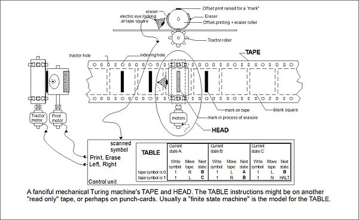

# The Increasing Influence of Computers in Geography

It would be naive to consider the development of geodemographics without also attending to the technological progress that has enabled that development.  Indeed, calls for an integration of compututional techniques and technologies with academic geographic study have come in periodic bursts over the last half-century or more, and from several slightly different angles, which we shall briefly summarize here. 

Geography's first *quantitative revolution* took place in the 1950s and '60s [@IBurton1963]; @PHaggett2008 pictures the movement as a diffusion process of key figures carrying the ideas from department to department (@Fig:QuantitativeDiffusion). One of these key figures was Waldo Tobler, whose 'Computer Movie Simulating Urban Growth' [@WTobler1970] is notable not just as pioneering work of computational geography, but for being the subject of the paper in which Tobler coined his now famous 'first law of geography' [@HMiller2004].

{#fig:QuantitativeDiffusion}

The term *Geographical Information System* (GIS) was first coined by @RTomlinson1969. The meaning of the 'S' later evolved from *Systems* to *Science*. The latter term (*Geographic Information Science*) was first defined by @MGoodchild1992, who argued that the focus of the field should be "thinking about science rather than systems" (p.44). This shift was reflected in the renaming in 1995 of the *International Journal of Geographical Information Systems* [@MGoodchild1995]. (One consequence of this shift means that it is often unclear in subsequent writing whether an author's reference to 'GIS' is intended to mean G.I. Systems or G. I. Science -- I will therefore try explicitly to refer to GISys. or GISci.)

In 1996, @SOpenshawAbrahart1996 opened the first conference on the freshly defined area of 'GeoComputation', with a manifesto suggesting eight different directions for potential research. GeoComputation was defined as including "the constituent technologies of high performance computing, artificial intelligence, and GIS" -- on the one hand, one might say it was therefore intended to be broader than GIS; on the other hand, it is more narrowly concerned with 'technologies' than Goodchild's call to prioritize more general questions of underlying 'science'. The conference led to a book by the same name edited by @PLongleyEtAl1998; a substantially new but functionally equivalent second edition has been produced by @CBrunsdonSingleton2015. @SOpenshawOpenshaw1977 advocated the utility and use of 'Artificial Intelligence in Geography', explaining the principles and relevance of neural networks, genetic algorithms, agent-based modelling, and fuzzy logic. Gahegan remarks that machine learning and AI have seen better progress in the last two decades than the other directions suggested for GeoComputation [@RHarrisEtAl2017].

Most recently, the term 'Data Science' has emerged [@DDonoho2017], with some suggesting that it represents a whole new paradigm for scientific research [@THeyEtAl2009]. More than fifty years ago, @JTukey1962 suggested that his work in data analysis be recognized as a science in its own right, rather than just an aspect of statistics, since statistics had become established as a branch of mathematics rather than a science as such. But it is only since the 'data deluge' [@THeyTrefethen2003] of the twenty-first century that such an idea has become mainstream. While every social science is unavoidably affected by the shift, responses vary in whether 'data science' is seen as a genuine paradigm-shift to be positively embraced, or more of a trend and trope whose challenge requires critique from a grounded theoretical disciplinary perspective. @ASingletonArribas-Bel2019, for example, advocate 'Geographic Data Science' as a necessary development for "sustaining the relevance of Geography and subdisciplinary approaches within a rapidly changing socio-technological landscape". @WKangEtAl2019 on the other hand argue that the need is the opposite way around: "a successful UDS ['Urban Data Science'] is impossible without a broader and more successful urban studies". 

# Precursors to the Computer Age

The history of computing should begin with the invention of the Analytical Engine developed by Charles Babbage [@ABromley1982] and explained and promoted by his assistant, the mathematician Ada Lovelace [@LMenabreaLovelace1843]. Physical devices to aid arithmetic calculation had existed since (at least) the creation of the abacus several centuries before the birth of Christ [@KSugden1981]. Shickard's 'calculating clock' of 1623 was probably the first true mechanical calculator; Pascal, Morland, Liebnitz, and Hahn all improved on this in various ways, before De Colmar's *arithmometer* became the first mechanical calculator put into general production [@DSollaPrice1984]. 

Babbage's first machine, the *Difference Engine*, while considerably more sophisticated in its conception, was still essentially also an arithmetical calculator. However, his *Analytical Engine* (@Fig:Babbage) was a true programmable Turing-complete computer, and as such deserves to be recognized as the beginning of a new era in technology. Unfortunately, although Lovelace explicitly recognized that the machine could be adapted to work with "letters or any other general symboly; and in fact it might bring out its results in algebraical notation" [@LMenabreaLovelace1843], Babbage himself does not seem to have recognized the ground-breaking implications of automated symbolic manipulation as opposed to mere numerical calculation [@DSwade2012]. At any rate, neither of Babbage's machines were ever completed -- at least not until almost two hundred years later [@DSwadeBabbage2001] -- and although the Analytical Engine pre-empted many of the features of twentieth-century digital computers, it does not seem to have actually been a direct influence.

{#fig:Babbage}

A more successful technological breakthrough can be seen with Hermann Hollerith's punch-card tabulating machine that was designed and used to process the results of the American census of 1890. Babbage's machines had also used punch-cards; both he and Hollerith seem to have been inspired by their use in the weavers' hand-looms created by the Frenchman Joseph-Marie Jacquard [@JEssinger2004]. Hollerith's Tabulating Machine was nothing like as ambitious in its functionality as Babbage's Analytical Engine, but unlike Babbage's, Hollerith's Machine swiftly achieved its intended purpose. The 1880 American census had taken seven years to process; Hollerith's solution permitted the data for sixty-two million citizens to be processed in just two and a half years [@GBilesEtAl1989]. In 1896 Hollerith incorporated the 'Tabulating Machine Company'; in 1924 its name was changed to the 'International Business Machines Corporation', now better known by its acronymn IBM [@GORegan2018].

# Foundational Theoretical Breakthroughs

Several theoretical breakthroughs were necessary before the true power of an automatic computing machine could become apparent: in particular, the theory of computability developed by @ATuring1936; the theory of functional logic developed by @AChurch1936; and the mathematical theory of communication developed by @CShannon1948.

Both Turing and Church developed their theories in attempting to solve the famous *Entscheidungsproblem* ('decision problem') posed by Hilbert in 1928 [@DHilbertAckermann1928], which asked for an algorithm able to decide whether a given statement is provable from a set of axioms -- they showed that such an algorithm is impossible, and therefore some decision problems are undecidable. 

This is related to the problem of proving the consistency of the axioms of arithmetic, which had been included in Hilbert's original 1900 list of significant unsolved mathematical problems [@RThiele2005], and which was solved by @KGodel1931, with his now famous Incompleteness Theorems. These effectively dashed the hopes of the logical positivists that all problems could be solved if only they could be framed in formal mathematics [@PMancosuEtAl2009]; this is ironic, considering how frequently accusations of 'positivism' have been directed at quantitative geographers [@ESheppard2014].

@AChurch1936, who was the first to publish his solution, framed his approach by proposing "a definition of effective calculability [...corresponding] to the somewhat vague intuitive notion in terms of which problems of this class are often stated" (p.346). He first explained the operation of the *lambda calculus*, a language for manipulating logical formulae, consisting of the symbols *{*, *}*, *(*, *)*,  *$\lambda$*, *[*, *]*, and other characters representing variables. This enabled him to identify the notion of an *effectively calculable* function with a *lambda-definable* function, and drawing on the work of Godel and others he was then able to show that there exist functions that are not lambda-definable.

The approach of @ATuring1936 was quite different. While Church's approach was language-oriented, Turing's was machine-oriented: he demonstrated that "it is possible to invent a single machine which can be used to compute any computable sequence" (p.241). He did this by a detailed description of the operation of such a 'universal computing machine', requiring only that it have a 'tape' which it could write to, read from, and move along, and a small set of inbuilt default instructions (which Turing called '*m*-configurations'). The solution to Hilbert's *Entscheidungsproblem* then becomes a question of showing that the machine is unable to ever compute the solution to the problem of whether an uncomputable number is computable; or equivalently, to compute whether an algorithm will eventually halt or not.

{#fig:TuringMachine}

The work of Turing and Church showed that if a language or a machine was capable of simple manipulations of data, it would also be capable of much more complex manipulation of data. Negatively they showed that some functions/algorithms cannot be computed, but this was done by showing positively that any that can be computed can be composed of just a few simple constituent parts. But it was @CShannon1948 who developed the *Mathematical Theory of Communication* which would allow for similar sophistication in considering what was required to conserve and communicate the information contained in any particular set of data. 

Shannon approaches the subject of communication as essentially *an engineering problem*, and shows how by considering the flow of information source as a stochastic process, it is possible to quantify how certain we are of the way in which a sequence of information will continue, given what we already know. By thus considering information's *entropy* (the concept is borrowed from statistical themodynamics), it becomes possible to quantify the channel capacity necessary to transmit a given message. Further, Shannon shows that it is even possible to reduce information loss across a 'noisy' loss-inducing channel to as small a level as desired, by deliberately encoding the necessary level of redundancy into the message before transmission.

Shannon's paper is also notable for being the first published instance of the concept of 'binary digits', or *bits*, though he credits Tukey with the invention of the term. He notes that any "device with two stable positions, such as a relay or a flip-flop circuit, can store one bit of information" (p.380).

# Key Developments in Computer Hardware Engineering

By the time Shannon's paper was published, computers had already been created that used electromechanical relays  and electronic circuits. Aiken's Harvard Mark I [@ICohen1990], put into operation in 1944, used the first; the ENIAC [@ABurks1947], completed in 1945, used the latter, in the form of vacuum tubes (also known as thermionic valves). While the latter was an improvement on the former, both were large, cumbersome and fragile.

However, in 1947 a Bell Labs team researching the nature of semiconductors made a discovery that led to the invention of transistors [@RNelson1962]. The key theoretical breakthrough was made by @WShockley1949, who left Bell Labs in 1955 to start his own semiconductor company in California -- thus marking the beginning of 'Silicon Valley' [@DBrock2012]. But while Shockley was a brilliant scientist he was a poor business manager, and in 1957 an alienated group of his scientists -- who came to be known as 'The Traitorous Eight' [@JKassing2011] -- left and founded their own company, Fairchild Semiconductor, which produced the first commercially viable integrated circuit [@GMoore1998]. 

Among those eight scientists was Gordon Moore [@AThackrayEtAl2015], who in 1965 observed that the number of transistor components fit onto an integrated circuit was roughly doubling each year, and predicted that "over the short term this rate can be expected to continue, if not to increase" [@GMoore1965]. In fact, the trend -- now known as *Moore's Law*, though it is an observed correspondence and not a physical law -- has held remarkably well for fifty years (@Fig:MooresLaw), although we are now perhaps approaching its necessary physical limits [@CMack2011].

{#fig:MooresLaw}

This exponential improvement in transistor density is significant because of its correlation with computers' processing power and economic affordability. *Bell's Law* [@GBell2008] explains how this progress creates new classes of computers, as each development offers four options: (1) maintaining constant price and increasing performance; (2) lowering price and performance to extend range; (3) extending performance with new supercomputers; (4) minimizing price with newly viable classes of microcomputer. With each new class of computer there comes a corresponding increase in their ubiquity [@DArribas-BelReades2018].

# *Software* and Programming Languages

To take advantage of the increasing processing power offered by computer hardware required corresponding developments in *software* -- another word apparently coined by Tukey [@FAnscombe2003] in an article for the American Mathematical Monthly [@JTukey1958]. In particular, what is needed is a way of clearly and concisely describing the *algorithms* to be performed by the computer.

Mathematical algorithms have existed since ancient times, with Euclid's algorithm for finding a greatest common divisor being the most famous [@DKnuth2014]. But such processes were described informally, with imprecise natural language. The rise of modern mathematics led to highly developed notation for describing static functional relations, but not for recursive dynamic processes [@DKnuthPardo1980] -- perhaps because before the invention of the computer there was no need. Perhaps the most accessible way of describing an algorithmic process, is with a *flow diagram*, using boxes and arrows to illustrate conditional instructions. This technique was used by @HGoldstinevonNeumann1948, but its visual nature means that while it is suitable for communicating to humans how a machine should be made to function, it is of no use for directly programming the machine.

The first high-level programming language [@PWegner1976] was FORTRAN (FORmula TRANslating system), the first version of which was released in 1954 [@JBackus1978], and which is still used for scientific computing today [@JKermode2020]. This built on previous work on assemblers and compilers which were able to convert symbolic programming instructions into machine code [@FAllen1981]. Wegner suggests that the '50s was a decade of discovering and describing the basic concepts of programming languages, and that the '60s was a decade of elaborating and analyzing them. Much could be said about the many programming languages that have emerged and evolved since then, and about their underlying principles [@JReynolds1998], but here I will focus on three issues that I see as key to the scientific utility of computation: platform independence, open source code, and readability.

Fortran was first implemented for a specific machine -- the IBM 704 [@JBackusEtAl1957]. For Fortran code to be written on a new type of machine, a completely new compiler had to be written specific to that machine. Fortunately, this is no longer necessary due to the concept of a machine-independent *operating system* (OS), which are now considered "an essential part of any computer system" [@ASilberschatzEtAl2011]. The first successful portable operating system was Unix, another product of Bell Labs [@DRitchieThompson1978]. Unix was developed together with the C programming language in which it was written. C is notable in that, for a human-readable computer language, it is 'rather low-level', dealing with 'the same sorts of objects that most computers do' [@DRitchieEtAl1978]. Portability was not initially the primary goal, but as the success of the system became apparent, efforts were made to refine and extend the C language so as to remove difficulties in functioning on a wide variety of machines [@SJohnsonRitchie1978].

But just because it is technically possible to run code on a machine, or to adapt it so that it will run, does not mean it is legally permissible. Using and adapting Unix required a license from AT&T, the proprietary owner [@ERaymond2000]. Refusing to submit to such a situation, Richard Stallman, an artificial intelligence researcher at MIT, announced his intention to "Free Unix!" by creating a compatible software system that would be free to adapt and copy, recursively named GNU (GNU's not Unix!) [@RStallman1983]. The achievement of creating a functional free OS kernel actually belongs though to Linus @LTorvalds1991's *Linux*. @ERaymond2001 attributes Torvalds' success to the way that he was able to mobilize a large number of beta-testers and co-developers to rapidly eliminate bugs and create a functioning product. He calls this *Linus' Law*: "Given enough eyeballs, all bugs are shallow".

If co-developers are to be able to easily spot bugs in others' code, it helps if a programming language is easily readable. @DKnuth1984 suggested that programmers shift their focus in writing programs from instructing the computer what to do, to explaining to a human what the computer is meant to do -- he called this *literate programming*. A prime example of this is the Python programming language [@GVanRossumDrakeJr1995], which has even been described as 'executable pseudocode' [@CDierbach2014].

# Artificial Intelligence and Machine Learning

While programming allows a human to specifically instruct a machine how to process given input, a different paradigm asks whether and how it is possible to enable a machine to learn what to do by giving it examples rather than specific instructions. @ATuring1950 considered the grand prospect of whether a computer might be able to convincingly imitate a human being (the 'Turing Test'). *Artificial Intelligence* as a field of research is generally considered to have begun with the Dartmouth Summer Research Project proposal put forward by @JMcCarthyEtAl1955. The practical question concerns the possibility of *machine learning*, a term first popularized by @ASamuel1959, who created a program that was able to learn "to play a better game of checkers than can be played by the person who wrote the program".

Regardless of how far off successful *imitation* of general human intelligence might be [@VMullerBostrom2016], substantial breakthroughs have been made in drawing *inspiration* from human cognitive architecture. @WMcCullochPitts1943 showed that there exists a straightforward correspondence between the binary logic of propositional calculus, and the physiological model of of the nervous system as a network of neurons which each have some threshold over which excitation triggers a synaptic impulse. @DHebb1949 attempted to account for the synaptic plasticity necessary to explain neural learning in such terms. The *Perceptron Algorithm* of @FRosenblatt1958 was the first demonstration of how an *Artificial Neural Network* could be trained to learn. However, a single-layered perceptron network is only able to distinguish linearly-separable data, and theoretical doubts about the value of multi-layer neural networks [@MMinskyPapert1969], as well as the technical issue of how much computational power is required, meant that it is only really in the last decade that the power of deep learning has become apparent [@TSejnowski2018].

Rosenblatt's Perceptron is an example of *supervised* learning, in that the algorithm requires that each point in its training dataset be labelled; in contrast, *unsupervised* machine learning requires no labels, and is useful for *pattern recognition* [@CBishop2006] in exploratory data analysis. The clearest examples of unsupervised machine learning are clustering algorithms. The earliest research into cluster analysis was done by R.C. Tryon [@RBlashfield1980], who sought to improve on the deficiencies of factor analysis [@RTryon1958a]. While his primary field of study was psychology, he applied his pioneering clustering methodology to a social area analysis of San Francisco [@RTryon1955]. Thus we can claim that geodemographic classification was one of the earliest applications of artificial intelligence, and certainly of A.I. in geography.

# References

